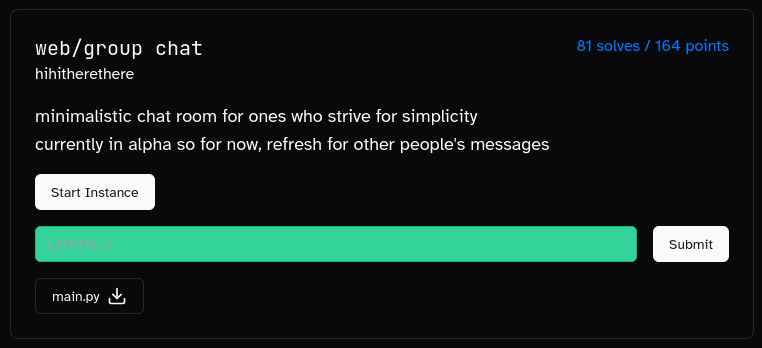
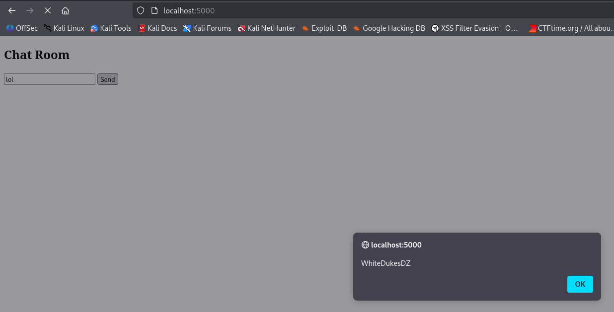

# WhiteDukesDZ - LIT CTF 2025 Writeup: Group Chat Challenge



We were also provided with the `main.py` file as part of this challenge.

---

## Challenge Summary

This challenge presented a simple Python Flask web application simulating a group chat. The goal was to analyze the application for vulnerabilities and exploit them to retrieve the flag.

## Provided Files
- `main.py` (Flask web app)
- Challenge image (see above)

## Application Analysis

After reviewing `main.py`, we identified three main endpoints:

1. **`/` (Home):**
    - If `username` is not set in the session, redirects to `/set_username`.
    - Otherwise, renders the chat page.

2. **`/set_username`:**
    - Accepts `GET` and `POST` requests.
    - On `GET`, displays a username form.
    - On `POST`, verifies the provided `username`:
      - If `username` length > 1000, registration is refused.
      - If `username` contains both `{` and `}`, registration is refused.
      - Otherwise, registration is accepted and redirects to `/`.

3. **`/send_message`:**
    - Accepts only `POST` requests with a `message`.
    - If `username` is not set in session, redirects to `/set_username`.
    - If `message` contains non-alphanumeric symbols, message is refused.
    - Otherwise, message is added to `chat_logs` as `username: message` and redirects to `/`.

### Security Observations

- The `/set_username` endpoint does not filter for XSS payloads in the `username` field. For example, setting `username` to `<script>alert('WhiteDukesDZ')</script>` and sending a message will execute the JavaScript payload:

  

- However, since the code executes only on the client side and there is no admin bot, this XSS cannot be leveraged to obtain the flag.

### Template Rendering

The chat logs are rendered as follows:

```python
<div id="chat-box">''' + '<br>'.join(chat_logs) + '''
</div>
```

If `chat_logs` is:

```python
chat_logs = [
     "username1: message1",
     "username2: message2"
]
```

It will be rendered as:

```html
username1: message1<br>username2: message2
```

---

## Solution

<!-- Describe your exploitation steps, payloads, and how you solved the challenge here. -->


